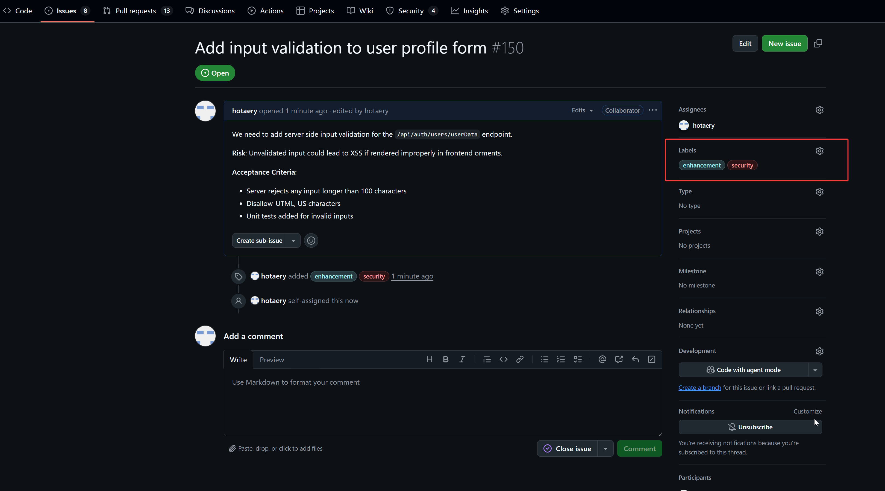
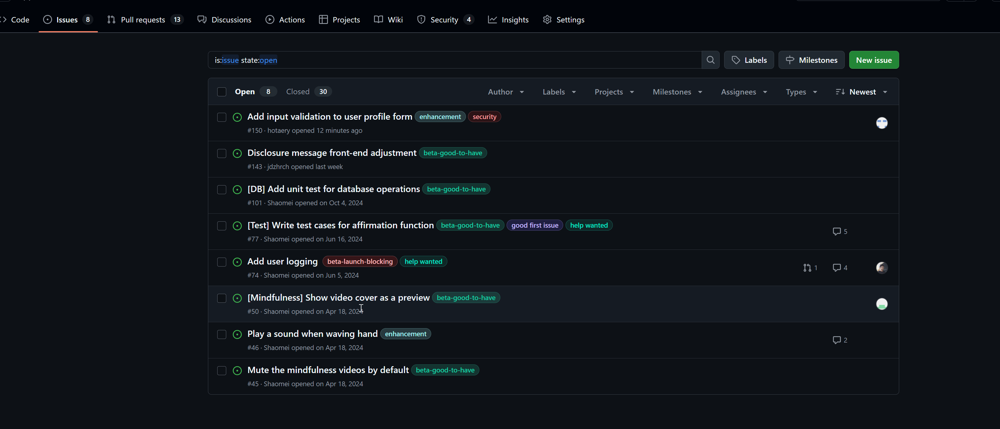
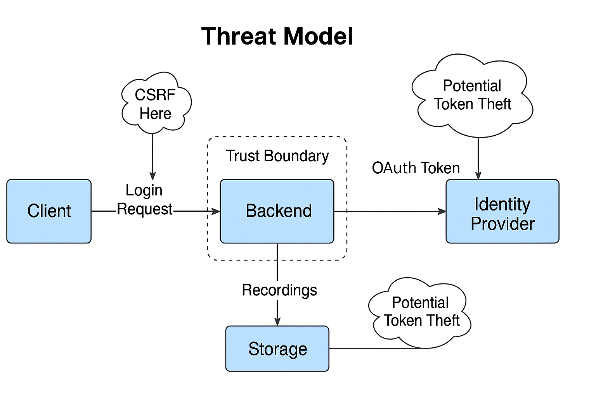
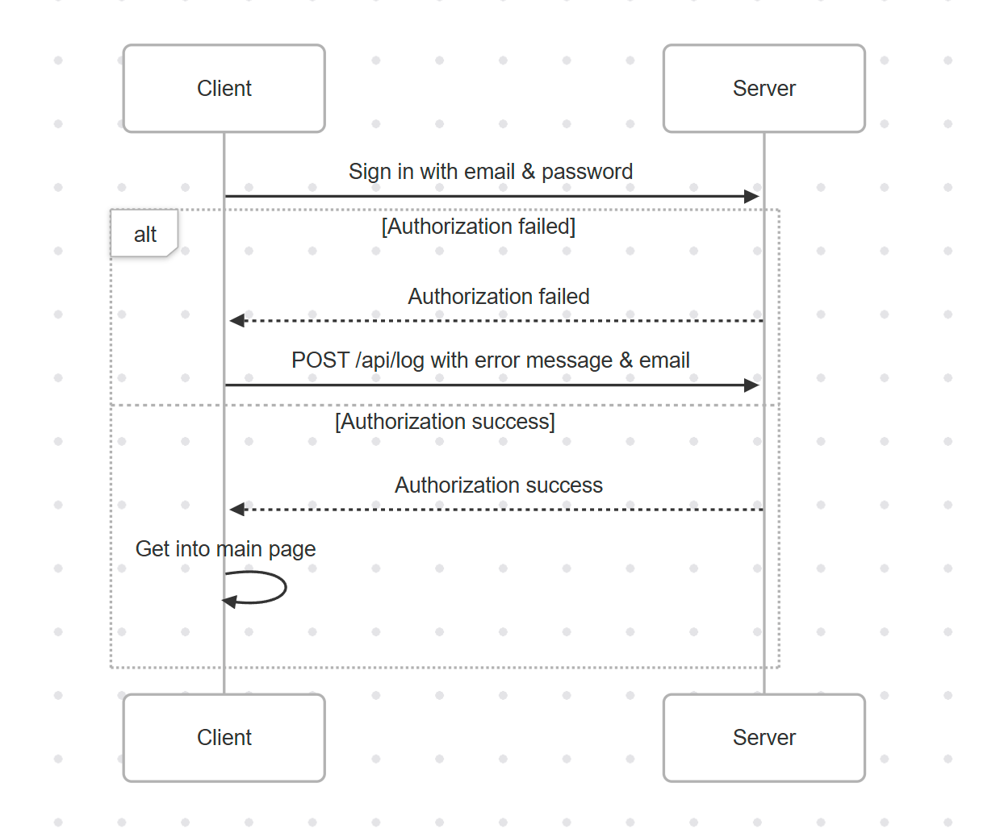
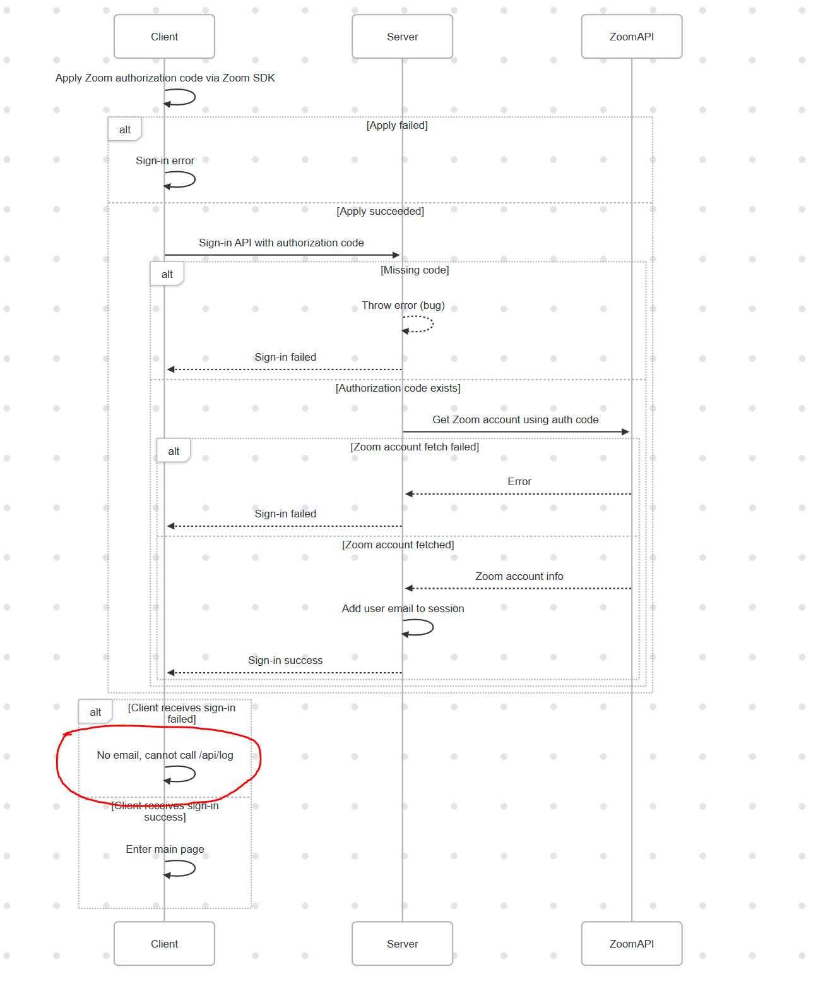
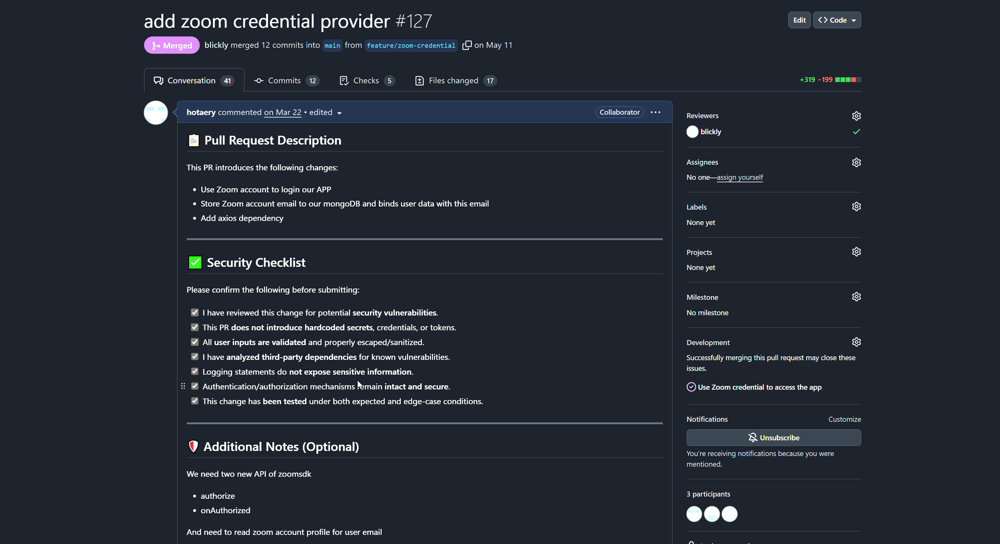
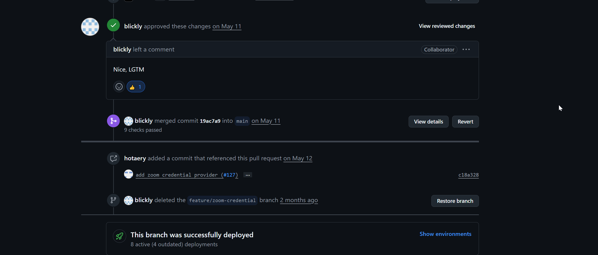
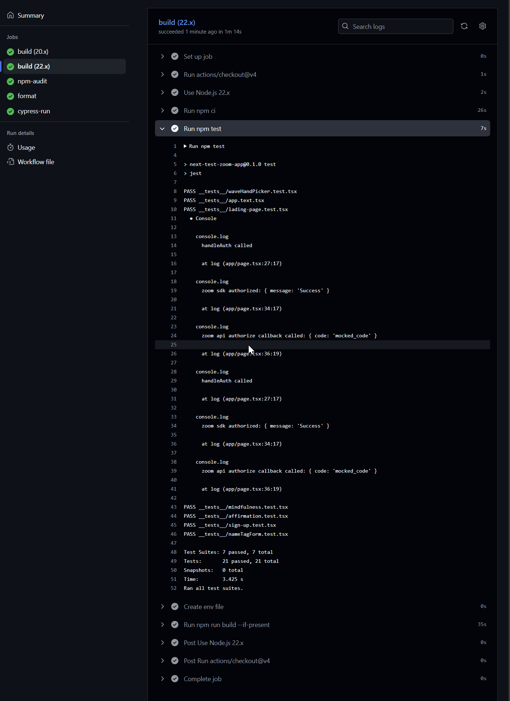
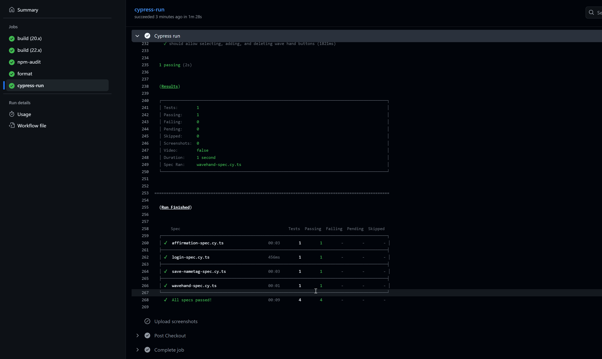
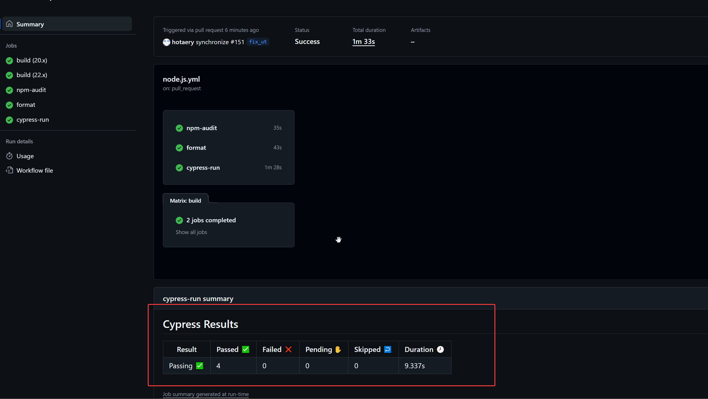

Secure Software Development Life Cycle (SSDLC)
- **Project Name**: LibOrate
- **Organization**: AImpower.org
- **Last Reviewed**: July 2025
- **Owner**: AImpower.org Security & Dev Team

## 1. Introduction
LibOrate is a videoconferencing companion Zoom App designed to support individuals who stutter by offering real-time emotional and relational support during videoconferencing. We adopt a Secure Software Development Lifecycle (SSDLC) model to embed security across all stages of development.

This document outlines the security practices and evidence associated with our SSDLC.

## 2. Requirements & Planning

We collect requirements via GitHub Issues and discussion with stakeholders. Each issue includes:

- Feature descriptions
- Security implications
- Acceptance criteria
- Tags for risk/priority
    - `beta-block-launching` is high-priority 
    - `beta-good-have` is low-priority

### ✅ Evidence:
- Screenshot of GitHub Issues with security labels and acceptance criteria

    

    

## 3. Design

- All features are designed using secure design principles (e.g., least privilege, input validation, rate limiting)
- Architecture diagrams are required before coding
- Threat modeling is performed using OWASP Threat Dragon
- Diagrams are reviewed and version-controlled in the repository

### ✅ Evidence:
- Threat modeling diagram screenshot

    

- Login via zoom OAuth flow diagram screenshot and compare with login via user/pass flow

    - Login via user/pass flow:

        

    - Login via zoom OAuth flow:

        

## 4. Implementation
- Code is written in GitHub repos using GitHub Flow
- `main` branch is protected and requires PR approval
- Code review includes a security checklist

### ✅ Evidence:
- Screenshot of PR with security checklist template

    

- Approved PR screenshot with reviewer notes

    

## 5. Testing

- Unit tests and Cypress E2E tests are required for all features
- GitHub Actions runs tests on each push/PR
- Security-related tests are included (e.g., input sanitization, auth)

✅ Evidence:
- GitHub Actions test results
    - Unit tests

        
    
    - Cypress E2E tests

        

        

## 6. Security Scanning (SAST/DAST)
- SAST:
    - [CodeQL](https://codeql.github.com/) runs on all PRs
    - [Snyk](https://snyk.io/) checks open source dependencies
    - `npm audit` is enforced in CI
- DAST:
    - [OWASP ZAP](https://owasp.org/www-project-zap/) runs against staging builds in CI

✅ Evidence:
Screenshot of CodeQL scan results

Screenshot of ZAP spider/scan summary

Screenshot of Snyk vulnerabilities

Screenshot of npm audit and GitHub output

### Dynamic Application Security Testing (DAST)
- OWASP ZAP is run monthly against the deployed Vercel URL.
- Tests include auth, input validation, and common attack vectors.

#### Evidence:

- ZAP Report: reports/zap_scan_jul2025.html

### Functional Testing
Unit tests and Cypress E2E tests are run via GitHub Actions.

Coverage > 85%

#### Evidence:

- Test result screenshot: images/testing.png

## 6. Deployment & Maintenance
- Deployments via Vercel from protected main branch.
- GitHub Actions automates:
    - Build → Test → Lint → SAST → Deploy
- Environment secrets managed via GitHub Secrets.
- Audit logs reviewed weekly in MongoDB Atlas and Vercel dashboards.

### Evidence:
- Deployment workflow: images/deploy_pipeline.png
- Secrets scan screenshot: images/secret_scanning_alert.png

## 7. Third-Party Penetration Testing
A 3rd-party pentest was conducted by [Vendor Name] in July 2025.
Scope included:

- Zoom OAuth flow
- Client-side data exposure
- Role-based access control
- XSS, CSRF, and IDOR risks

### Summary:

- 0 Critical
- 1 High (resolved in PR #43)
- 2 Medium (resolved in PR #44, #45)

### Evidence:

- Penetration test report: reports/3rdparty_pentest_liborate.pdf

## 8. Security Policy
- We have a documented SECURITY.md describing our responsible disclosure process.
- All known vulnerabilities are tracked as GitHub Issues and patched within 48 hours.

### Evidence:

- SECURITY.md
- Screenshot: images/security_policy.png
- Issue tracking: images/security_incident_issue.png

