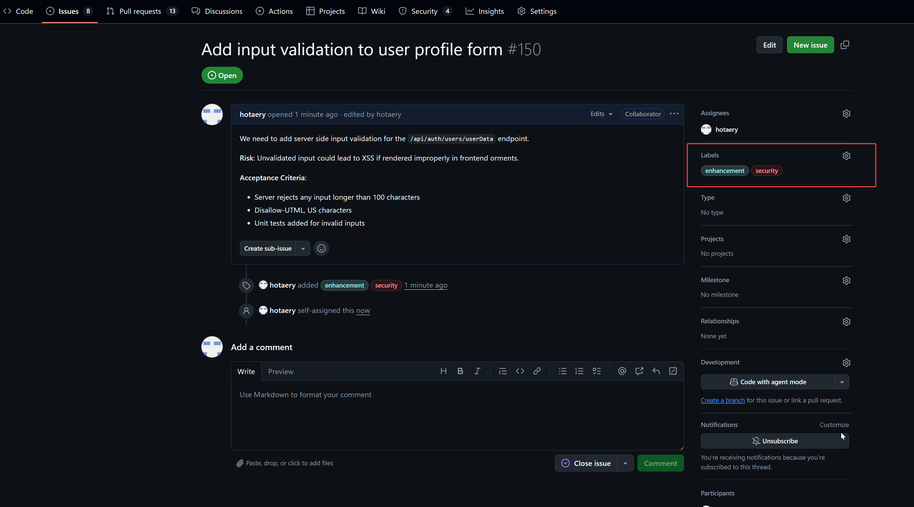

Secure Software Development Life Cycle (SSDLC)

- **Project Name**: LibOrate
- **Organization**: AImpower.org
- **Last Reviewed**: July 2025
- **Owner**: AImpower.org Security & Dev Team

## 1. Introduction

LibOrate is a videoconferencing companion Zoom App designed to support individuals who stutter by offering real-time emotional and relational support during videoconferencing. We adopt a Secure Software Development Lifecycle (SSDLC) model to embed security across all stages of development.

This document outlines the security practices and evidence associated with our SSDLC.

## 2. Requirements & Planning

We collect requirements via GitHub Issues and discussion with stakeholders. Each issue includes:

- Feature descriptions
- Security implications
- Acceptance criteria
- Tags for risk/priority
  - `beta-block-launching` is high-priority
  - `beta-good-have` is low-priority

### ✅ Evidence:

- Screenshot of GitHub Issues with security labels and acceptance criteria

  

  

## 3. Design

- All features are designed using secure design principles (e.g., least privilege, input validation, rate limiting)
- Architecture diagrams are required before coding
- Threat modeling is performed using OWASP Threat Dragon
- Diagrams are reviewed and version-controlled in the repository

### ✅ Evidence:

- Threat modeling diagram screenshot

  

- Login via zoom OAuth flow diagram screenshot and compare with login via user/pass flow

  - Login via user/pass flow:

    

  - Login via zoom OAuth flow:

    

## 4. Implementation

- Code is written in GitHub repos using GitHub Flow
- `main` branch is protected and requires PR approval
- Code review includes a security checklist

### ✅ Evidence:

- Screenshot of PR with security checklist template

  

- Approved PR screenshot with reviewer notes

  

## 5. Testing

- Unit tests and Cypress E2E tests are required for all features
- GitHub Actions runs tests on each push/PR
- Security-related tests are included (e.g., input sanitization, auth)

✅ Evidence:

- GitHub Actions test results

  - Unit tests

    

  - Cypress E2E tests

    

    

## 6. Security Verification (SAST, DAST, Dependency Scanning)

- Static Application Security Testing (SAST)

  - **Tools**: [GitHub CodeQL](https://codeql.github.com), [Snyk Code](https://snyk.io/)
  - **Scope**: Entire codebase (JavaScript/TypeScript frontend, Node.js backend)
  - **Run**: On every pull request and nightly build
  - **Findings**: Must be resolved or triaged before merge

- Dependency Scanning

  - **Tool**: [GitHub Dependency Review](https://github.com/actions/dependency-review-action), `npm audit`
  - Run: On every PR that changes package.json, package-lock.json, or other dependency manifests
  - Policy: Merges are blocked if high/critical CVEs are detected

- Dynamic Application Security Testing (DAST)

  - **Tools**: [OWASP ZAP](https://owasp.org/www-project-zap/)
  - **Scope**: Staging environment API endpoints and web UI
  - **Run**: On staging before releases
  - **Checks**: SQL injection, XSS, CSRF, authentication bypass, open redirects

### ✅ Evidence:

- Snyk Code scan results showing no any issues in code. Please see `snyk_report.pdf` for full report.

  

  

- Github CodeQL scan results showing no high/critical vulnerabilities in code

  

  

- GitHub Dependency Review report with no critical issues

  

- Run `npm audit` on every PR

  

- Every PR is scanned for critical vulnerabilities using Snyk Code and Github CodeQL and Github Dependency Review.

  

- OWASP ZAP scan summary for staging. Please see `zap_report.pdf` for full report.

  

## 7. Deployment & Release

- Deployment to production is automated via GitHub Actions and requires:
  - Passing all tests (unit, E2E)
  - Approval from at least one security reviewer
- Staging and production use separate secrets managed in GitHub Actions Secrets
- Production builds are signed and verified before deployment
- Rollback plan documented for each release

### ✅ Evidence:

- Screenshot of GitHub Actions workflow to execute unit and E2E tests automatically

  

  

  

- Screenshot of GitHub Actions workflow to deploy to production

  

  
